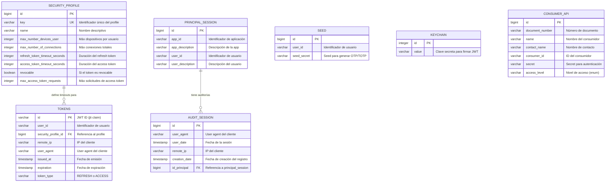

# Esquema de Base de Datos - Joko Security

Este documento describe el esquema completo de la base de datos de Joko Security, incluyendo todas las tablas, sus relaciones y propósito.

## Índice

- [Diagrama de Entidad-Relación](#diagrama-de-entidad-relación)
- [Descripción de Tablas](#descripción-de-tablas)
- [Relaciones entre Tablas](#relaciones-entre-tablas)

## Diagrama de Entidad-Relación



## Descripción de Tablas

### 1. security_profile

**Propósito:** Define perfiles de seguridad que configuran el comportamiento de los tokens JWT. Cada perfil determina cuánto tiempo viven los tokens y cuántas conexiones simultáneas se permiten.

**Campos clave:**
- `key`: Identificador único del perfil (ej: "DEFAULT", "ADMIN", "MOBILE")
- `refresh_token_timeout_seconds`: Tiempo de vida del refresh token en segundos
- `access_token_timeout_seconds`: Tiempo de vida del access token en segundos
- `max_number_devices_user`: Límite de dispositivos conectados por usuario
- `revocable`: Indica si los tokens de este perfil pueden ser revocados

**Ejemplos de perfiles:**
| Profile | Refresh Token | Access Token | Uso |
|---------|---------------|--------------|-----|
| DEFAULT | 24 horas | 30 minutos | Usuarios web estándar |
| ADMIN | 8 horas | 15 minutos | Administradores |
| MOBILE | 30 días | 24 horas | Apps móviles |

### 2. tokens

**Propósito:** Almacena todos los tokens JWT activos emitidos por el sistema. Se usa para validación y revocación de tokens.

**Campos clave:**
- `id`: El JWT ID (claim `jti` del token), usado como primary key
- `user_id`: Usuario propietario del token
- `security_profile_id`: Referencia al perfil que determina las características del token
- `token_type`: Tipo de token (`REFRESH` o `ACCESS`)
- `expiration`: Fecha de expiración del token
- `remote_ip` / `user_agent`: Información del cliente para auditoría

**Tipos de tokens:**
- **REFRESH**: Token de larga duración usado solo para obtener access tokens
- **ACCESS**: Token de corta duración usado para acceder a APIs protegidas

**Ciclo de vida:**
1. Token creado durante login o refresh
2. Almacenado en la tabla con estado activo
3. Validado en cada request
4. Eliminado o marcado como revocado al expirar o hacer logout

### 3. principal_session

**Propósito:** Rastrea sesiones activas de usuarios por aplicación. Permite identificar qué usuarios están conectados a qué aplicaciones.

**Campos clave:**
- `app_id`: Identificador de la aplicación
- `user_id`: Identificador del usuario
- `app_description` / `user_description`: Nombres descriptivos para reportes

**Constraint único:** La combinación `(app_id, user_id)` es única, asegurando una sola sesión activa por usuario-app.

### 4. audit_session

**Propósito:** Tabla de auditoría que registra todos los eventos de sesión. Permite rastrear históricamente quién accedió, cuándo y desde dónde.

**Campos clave:**
- `id_principal`: Referencia al registro de `principal_session`
- `user_date`: Fecha del evento de sesión
- `remote_ip`: IP desde donde se originó la sesión
- `user_agent`: Información del navegador/cliente
- `creation_date`: Fecha de creación del registro de auditoría

**Relación con principal_session:** Cada registro de auditoría está asociado a una sesión principal mediante `id_principal`.

### 5. seed

**Propósito:** Almacena seeds (semillas) para autenticación de dos factores (2FA) usando TOTP/OTP. Cada usuario puede tener un seed asociado.

**Campos clave:**
- `user_id`: Identificador del usuario
- `seed_secret`: Seed secreto usado para generar códigos OTP

**Flujo de 2FA:**
1. Usuario configura 2FA proporcionando un seed durante login
2. Seed se guarda en esta tabla
3. Aplicación authenticator usa el seed para generar códigos OTP
4. Sistema valida códigos OTP contra el seed almacenado

### 6. keychain

**Propósito:** Almacena las claves secretas usadas para firmar y verificar tokens JWT. Centraliza la gestión de secretos criptográficos.

**Campos clave:**
- `id`: Identificador de la clave (típicamente ID=1 para el secret principal)
- `value`: La clave secreta en sí (hasta 500 caracteres)

**Seguridad:**
- En modo "BD": El secret se almacena en esta tabla con permisos restrictivos
- En modo "FILE": El secret se lee de un archivo del sistema
- La constante `JOKO_TOKEN_SECRET = 1` identifica el secret principal para JWT

### 7. consumer_api

**Propósito:** Registra consumidores de API que pueden acceder al sistema con autenticación a nivel de servicio (no de usuario individual).

**Campos clave:**
- `consumer_id`: Identificador único del consumidor
- `secret`: Credencial secreta para autenticación
- `access_level`: Nivel de acceso del consumidor
  - `ON_BEHALF_USER`: Acceso en nombre de un usuario
  - `ON_BEHALF_USER_LAZY`: Acceso lazy en nombre de usuario
  - `ADMIN`: Acceso administrativo

**Uso:** Para integraciones sistema-a-sistema donde un servicio externo necesita acceder a la API sin credenciales de usuario específico.

## Relaciones entre Tablas

### 1. TOKENS → SECURITY_PROFILE (Many-to-One)

**Relación:** Múltiples tokens pueden usar el mismo security profile.

**Propósito:** Cada token hereda las configuraciones de timeout y límites del profile asociado. Esto permite:
- Cambiar políticas de seguridad actualizando el profile sin tocar tokens individuales
- Aplicar diferentes reglas a diferentes tipos de usuarios (web, mobile, admin)

**Ejemplo:**
```
security_profile (id=1, key="MOBILE", refresh_timeout=2592000, access_timeout=86400)
  ├── token (id="abc123", type=REFRESH, expiration=now+30days)
  ├── token (id="def456", type=ACCESS, expiration=now+24hours)
  └── token (id="ghi789", type=REFRESH, expiration=now+30days)
```

### 2. AUDIT_SESSION → PRINCIPAL_SESSION (Many-to-One)

**Relación:** Múltiples registros de auditoría pueden asociarse a una sesión principal.

**Propósito:** Mantener un historial completo de eventos para cada sesión de usuario-aplicación. Permite:
- Rastrear todas las interacciones de una sesión específica
- Análisis de patrones de uso
- Investigación de seguridad y compliance

**Ejemplo:**
```
principal_session (id=1, app_id="mobile-app", user_id="user123")
  ├── audit_session (id=1, user_date=2025-01-01 10:00, ip=192.168.1.1)
  ├── audit_session (id=2, user_date=2025-01-01 10:30, ip=192.168.1.1)
  └── audit_session (id=3, user_date=2025-01-01 11:00, ip=192.168.1.5)
```

### 3. Tablas Independientes

Las siguientes tablas no tienen relaciones de clave foránea pero se relacionan lógicamente por `user_id`:

- **SEED**: Se relaciona con usuarios mediante `user_id` (no FK para flexibilidad)
- **KEYCHAIN**: Tabla de configuración global, sin relaciones
- **CONSUMER_API**: Entidades independientes para autenticación de servicios

## Esquema de Nombres

Todas las tablas residen en el schema `joko_security`:
- Separación lógica de otros schemas de la aplicación
- Facilita permisos y backup granulares
- Permite despliegue modular

## Índices y Constraints

### Constraints Únicos:
- `security_profile.key`: Único
- `principal_session(app_id, user_id)`: Combinación única

### Primary Keys:
- Todas las tablas tienen PK definidas
- `tokens` usa el JWT ID como PK natural
- Otras tablas usan sequences autoincrementales

## Migraciones

Las migraciones se gestionan con **Liquibase**:
- Changelog principal: `src/main/resources/db/liquibase/db-changelog.xml`
- Scripts SQL en: `db/sql-initialization/`

## Referencias

- [Flujo de Autenticación](./joko-authentication-flow.md) - Cómo se usan los tokens
- [README.md](../README.md) - Información general del proyecto
- [Código fuente: Entidades](../src/main/java/io/github/jokoframework/security/entities/)
