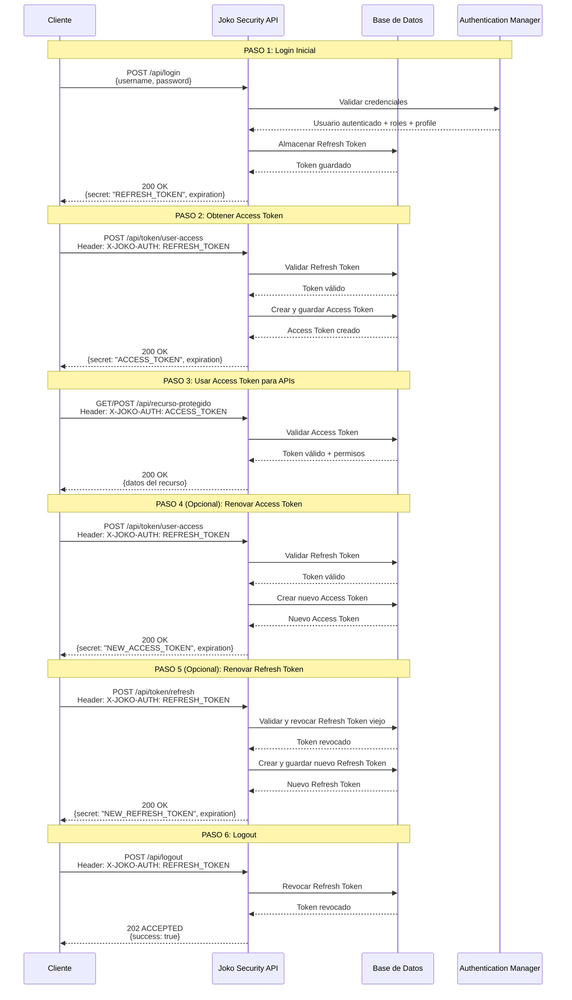
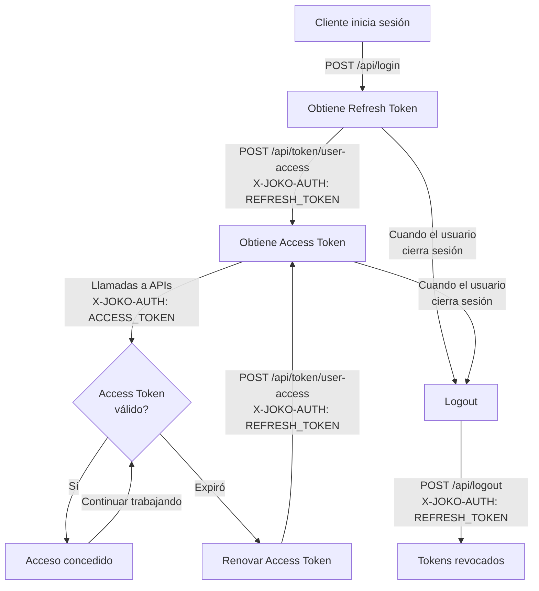
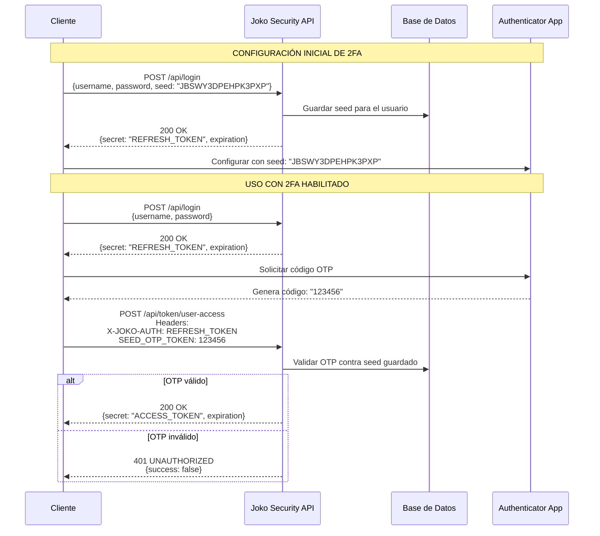
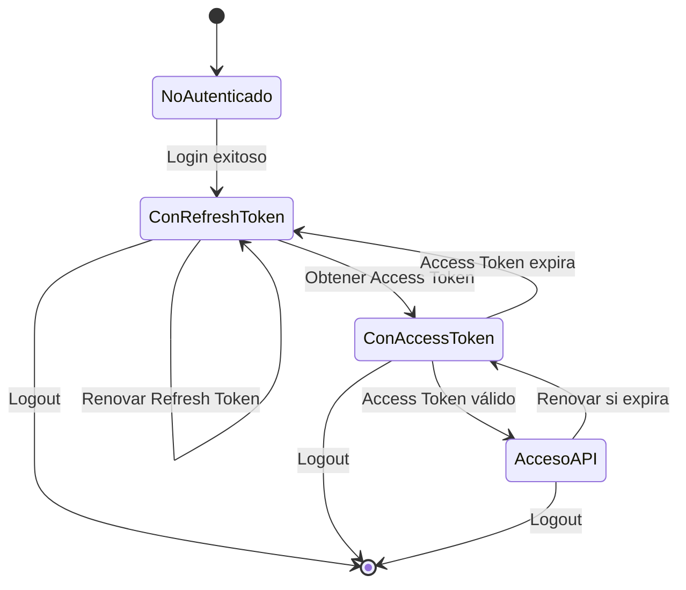

# Flujo de Autenticación - Joko Security

Este documento describe el flujo completo de autenticación y manejo de tokens en Joko Security.

## Índice

- [Conceptos Clave](#conceptos-clave)
- [Flujo Completo de Autenticación](#flujo-completo-de-autenticación)
- [Endpoints Disponibles](#endpoints-disponibles)
- [Flujo con Autenticación de Dos Factores (2FA)](#flujo-con-autenticación-de-dos-factores-2fa)

## Conceptos Clave

### Tipos de Tokens

Joko Security maneja dos tipos de tokens JWT:

1. **Refresh Token** (Token de Refresco)
   - Obtenido después del login exitoso
   - Vida larga (configurado según el security profile)
   - Permisos limitados
   - Se usa SOLAMENTE para obtener Access Tokens
   - No se usa para llamadas a APIs protegidas

2. **Access Token** (Token de Acceso)
   - Obtenido intercambiando un Refresh Token válido
   - Vida corta (configurado según el security profile)
   - Contiene todos los permisos y roles del usuario
   - Se usa para todas las llamadas a APIs protegidas

### Security Profiles

Los security profiles definen la duración de los tokens:

- **DEFAULT**: Perfil estándar para usuarios regulares
- **ADMIN**: Perfil para administradores
- **MOBILE**: Perfil optimizado para aplicaciones móviles (tokens de mayor duración)

### Headers Importantes

- `X-JOKO-AUTH`: Header usado para enviar tokens (Refresh o Access según el endpoint)
  - **IMPORTANTE**: Se envía el token SIN el prefijo "Bearer"
- `SEED_OTP_TOKEN`: Header opcional para el código OTP cuando 2FA está habilitado

## Flujo Completo de Autenticación



## Flujo Simplificado de Uso Cotidiano



## Endpoints Disponibles

### 1. Login - `/api/login`

**Método:** `POST`

**Descripción:** Autentica al usuario y devuelve un Refresh Token.

**Request Body:**
```json
{
  "username": "testuser",
  "password": "test123",
  "seed": "OPTIONAL_OTP_SEED"  // Opcional: para configurar 2FA
}
```

**Response (200 OK):**
```json
{
  "success": true,
  "secret": "eyJhbGciOiJIUzI1NiJ9...",  // Refresh Token
  "expiration": 1766146891000
}
```

**Códigos de Error:**
- `401 UNAUTHORIZED`: Credenciales inválidas
  - `ERROR_BAD_CREDENTIALS`: Usuario o contraseña incorrectos
  - `ERROR_ACCOUNT_DISABLED`: Cuenta deshabilitada
  - `ERROR_ACCOUNT_LOCKED`: Cuenta bloqueada

---

### 2. Obtener Access Token - `/api/token/user-access`

**Método:** `POST`

**Descripción:** Intercambia un Refresh Token por un Access Token.

**Headers:**
- `X-JOKO-AUTH`: Refresh Token (sin "Bearer")
- `SEED_OTP_TOKEN`: Código OTP (solo si 2FA está habilitado)

**Response (200 OK):**
```json
{
  "success": true,
  "secret": "eyJhbGciOiJIUzI1NiJ9...",  // Access Token
  "expiration": 1766060491000
}
```

**Códigos de Error:**
- `403 FORBIDDEN`: Refresh Token inválido o expirado
- `401 UNAUTHORIZED`: OTP inválido (si 2FA habilitado)

---

### 3. Renovar Refresh Token - `/api/token/refresh`

**Método:** `POST`

**Descripción:** Revoca el Refresh Token actual y genera uno nuevo.

**Headers:**
- `X-JOKO-AUTH`: Refresh Token actual

**Response (200 OK):**
```json
{
  "success": true,
  "secret": "eyJhbGciOiJIUzI1NiJ9...",  // Nuevo Refresh Token
  "expiration": 1766146891000
}
```

**Nota:** El token viejo queda revocado y no puede ser reutilizado.

---

### 4. Información de Token - `/api/token/info`

**Método:** `GET`

**Descripción:** Obtiene información sobre un Access Token.

**Query Parameters:**
- `accessToken`: El Access Token a consultar

**Response (200 OK):**
```json
{
  "success": true,
  "userId": "testuser",
  "expiresIn": 86400  // Segundos restantes hasta expiración
}
```

---

### 5. Logout - `/api/logout`

**Método:** `POST`

**Descripción:** Revoca el Refresh Token del usuario, cerrando su sesión.

**Headers:**
- `X-JOKO-AUTH`: Refresh Token

**Response (202 ACCEPTED):**
```json
{
  "success": true
}
```

## Flujo con Autenticación de Dos Factores (2FA)



### Configuración de 2FA

1. **Primera vez - Guardar Seed:**
   ```bash
   POST /api/login
   {
     "username": "testuser",
     "password": "test123",
     "seed": "JBSWY3DPEHPK3PXP"
   }
   ```

2. **Configurar Authenticator App:**
   - Usar el seed en una app como Google Authenticator o Authy
   - La app generará códigos OTP de 6 dígitos cada 30 segundos

3. **Login posterior con 2FA:**
   ```bash
   # Paso 1: Login normal
   POST /api/login
   {
     "username": "testuser",
     "password": "test123"
   }

   # Paso 2: Obtener Access Token con OTP
   POST /api/token/user-access
   Headers:
     X-JOKO-AUTH: <refresh_token>
     SEED_OTP_TOKEN: 123456  # Código actual de la app
   ```

## Mejores Prácticas

1. **Almacenamiento Seguro:**
   - Guardar Refresh Token en almacenamiento seguro (e.g., Keychain en iOS, KeyStore en Android)
   - Nunca guardar tokens en localStorage en aplicaciones web

2. **Manejo de Expiración:**
   - Implementar renovación automática de Access Token cuando esté próximo a expirar
   - Mantener el Refresh Token actualizado usando `/api/token/refresh` periódicamente

3. **Seguridad:**
   - Usar HTTPS para todas las comunicaciones
   - Implementar mecanismos de detección de tokens comprometidos
   - Revocar tokens al detectar actividad sospechosa

4. **User Experience:**
   - Renovar Access Token en segundo plano antes de que expire
   - Implementar logout automático al revocar tokens
   - Solicitar OTP solo cuando sea necesario (al obtener Access Token, no en cada llamada)

## Security Profiles y Duración de Tokens

La duración de los tokens se configura en la tabla `security_profile`:

| Profile | Refresh Token | Access Token | Uso Típico |
|---------|---------------|--------------|------------|
| DEFAULT | 24 horas | 30 minutos | Usuarios web estándar |
| ADMIN | 8 horas | 15 minutos | Administradores (mayor seguridad) |
| MOBILE | 30 días | 24 horas | Apps móviles (mejor UX) |

**Nota:** Estos valores son configurables en la base de datos.

## Ejemplos de Uso

Ver el archivo `/development/api-tests/auth.http` para ejemplos completos de todos los endpoints con requests HTTP reales.

## Diagrama de Estados de Token



## Referencias

- [README.md](../README.md) - Información general del proyecto
- [migration.md](migration.md) - Información sobre la migración a Spring Boot 3
- [Código fuente: AuthenticationController.java](../src/main/java/io/github/jokoframework/security/controller/AuthenticationController.java)
- [Código fuente: TokenController.java](../src/main/java/io/github/jokoframework/security/controller/TokenController.java)
